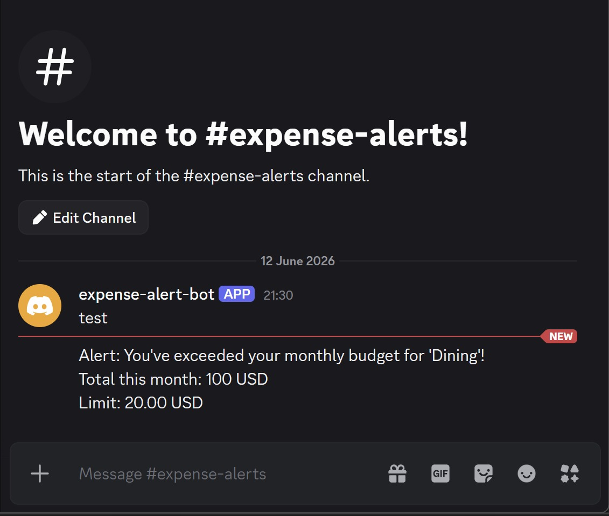

# Expense Tracker API

A Django REST Framework backend for tracking personal expenses with categories, currency conversion, and budget alerts.

---

## Bugs Found and Fixed

### Bug 1 — Serializer field typo
- **Description:** The `ExpenseSerializer` referenced a field named `catgory` instead of `category`.
- **Root cause:** Typo in the `fields` list inside `ExpenseSerializer`.
- **Fix:** Renamed `catgory` to `category` in `expenses/serializers.py`.
- **Commit:** `629b473`

### Bug 2 — Serializer variable name typo
- **Description:** The `expense_list` view used `serialzer` instead of `serializer`, causing a `NameError` on POST requests.
- **Root cause:** Typo in variable name in `expenses/views.py` line 40.
- **Fix:** Renamed `serialzer` to `serializer`.
- **Commit:** `e0a43fe`

### Bug 3 — Summary URL routing conflict
- **Description:** `GET /api/expenses/summary/` raised a `ValueError` because Django matched `summary` as a `<pk>` parameter.
- **Root cause:** The `expenses/summary/` path was defined after `expenses/<pk>/` in `urls.py`, so Django tried to look up an expense with `pk="summary"`.
- **Fix:** Moved `expenses/summary/` above `expenses/<pk>/` in `expenses/urls.py`.
- **Commit:** `f63dc8b`

### Bug 4 — Missing `Sum` import
- **Description:** The `expense_summary` view raised a `NameError: name 'Sum' is not defined`.
- **Root cause:** `Sum` from `django.db.models` was not imported in `views.py`.
- **Fix:** Added `from django.db.models import Sum` to the imports.
- **Commit:** `52d6646`

### Bug 5 — Inclusive date filtering
- **Description:** The `start_date` filter used `date__gt` (exclusive) instead of `date__gte` (inclusive), so expenses on the start date were excluded.
- **Root cause:** Wrong ORM lookup suffix in `expense_list` view.
- **Fix:** Changed `date__gt` to `date__gte`.
- **Commit:** `1afe9d7`

---

## My Features

### Authentication
- **Overview:** Token-based authentication using DRF's built-in `TokenAuthentication`. All endpoints are protected by default. Users register and receive a token, which must be included in every request as `Authorization: Token <token>`.
- **Design decisions:** Used DRF's built-in token auth for simplicity and reliability. All expenses and categories are scoped to the authenticated user — no user can access another user's data.
- **API changes:**
  - `POST /api/auth/register/` — create a new user, returns token
  - `POST /api/auth/login/` — authenticate and return token
- **Example:**
```json
// POST /api/auth/register/
{ "username": "prasna", "password": "secret123" }

// 201 Created
{ "token": "abc123..." }
```
- **Assumptions:** One token per user. Tokens do not expire.
- **Known limits:** No token refresh or expiry mechanism.

---

### Currency Conversion
- **Overview:** Expenses can be recorded in any ISO currency. The summary endpoint converts all amounts to `BASE_CURRENCY` (set in `.env`) using live exchange rates from `open.er-api.com`.
- **Design decisions:** Used `open.er-api.com` — free, no API key required. Conversion happens at query time in the summary endpoint. Raw amounts are stored as-is in the original currency.
- **API changes:**
  - `Expense` model now has a `currency` field (default: `USD`)
  - `GET /api/expenses/summary/` returns converted totals with `base_currency` and `as_of` date
- **Example:**
```json
// POST /api/expenses/
{
  "title": "Hotel in Paris",
  "amount": "120.00",
  "currency": "EUR",
  "category": 1,
  "date": "2026-06-11"
}

// GET /api/expenses/summary/
{
  "base_currency": "USD",
  "as_of": "Fri, 12 Jun 2026 00:02:31 +0000",
  "categories": [
    { "category": "Food", "total": 148.61 }
  ]
}
```
- **Assumptions:** Exchange rates are fetched live on every summary request.
- **Known limits:** No caching — heavy usage may hit rate limits.

---

### Budget Threshold Bot Alerts
- **Overview:** Each category can have a `monthly_limit`. When a created or updated expense pushes that category's month-to-date total over the limit, a Discord bot sends an alert to a configured channel.
- **Design decisions:** Used Discord bot API (`discord.com/api/v10`) — free, no SMS required. Alert is sent synchronously after the expense is saved. Credentials come from `.env` (`BOT_TOKEN`, `BOT_CHAT_ID`).
- **API changes:**
  - `Category` model now has a `monthly_limit` field (optional)
  - Alert fires automatically on `POST /api/expenses/` and `PUT /api/expenses/{id}/`
- **Example:**
```json
// POST /api/categories/
{ "name": "Dining", "monthly_limit": "200.00" }

// POST /api/expenses/ — pushes total over limit
{ "title": "Dinner out", "amount": "45.00", "category": 2, "date": "2026-06-12" }
```
Bot message:
'''
Alert: You've exceeded your monthly budget for 'Dining'!
'''

Total this month: 215.00 USD

Limit: 200.00 USD
- **Assumptions:** Alert fires every time the limit is exceeded, not just once.
- **Known limits:** Alert is sent on the request path — a slow Discord API could delay the response.

>  Screenshot of Discord alert: 

---

### CSV Export (Optional)
- **Overview:** Users can export all their expenses as a CSV file.
- **Design decisions:** Uses Django's `HttpResponse` with `text/csv` content type. All expenses for the authenticated user are included.
- **API changes:**
  - `GET /api/expenses/export/` — returns a downloadable `expenses.csv` file
- **Example columns:** ID, Title, Amount, Currency, Category, Date, Notes
- **Assumptions:** Exports all expenses with no filtering.
- **Known limits:** No date range filtering on export yet.

---

### Analytics Dashboard (Optional)
- **Overview:** Returns spending insights for the authenticated user.
- **Design decisions:** All calculations done server-side using Django ORM aggregations. Returns a single response with multiple metrics for frontend efficiency.
- **API changes:**
  - `GET /api/expenses/analytics/` — returns analytics data
- **Example response:**
```json
{
  "total_spent": 230.00,
  "monthly_spent": 230.00,
  "avg_expense": 38.33,
  "expense_count": 6,
  "top_category": "Food",
  "most_expensive_expense": {
    "title": "Hotel in Paris",
    "amount": 120.00,
    "currency": "EUR",
    "date": "2026-06-11"
  },
  "spending_last_six_months": [
    { "month": "2026-01", "total": 0.0 },
    { "month": "2026-06", "total": 230.0 }
  ],
  "days_since_last_expense": 1
}
```
- **Assumptions:** Amounts are not converted to base currency in analytics.
- **Known limits:** No currency conversion applied to totals.